# dev-workgraph — Architecture

High-level architecture of the **dev-workgraph-cli** pipeline: how Git evidence becomes a defensible career narrative (`RECONSTRUCTION.<project>.md`). Product rules and field-level specs live in [`REQUIREMENTS.md`](REQUIREMENTS.md). Diagram sources: [`uml/`](uml/) ([`uml/README.md`](uml/README.md) — Ollama / LM Studio legend) — regenerate PNGs with [`scripts/generatePNGFromSchemas.sh`](scripts/generatePNGFromSchemas.sh) → [`img/`](img/).

## Purpose

dev-workgraph is a **local CLI** (Node.js + TypeScript + Ollama / LM Studio) that:

- reconstructs *what* changed and *where* from **your** Git history;
- asks **role-aware questions** about what Git cannot know (ownership, intent, production, design vs implementation);
- weaves **your answers** into IMPACT narrative, role bullets, and CV bullets;
- writes a personal artifact for **performance review**, **CV**, or **interview prep** — without inventing impact you did not confirm.

It is **not** a commit counter, portfolio generator, or cloud SaaS. All analysis stays under `~/.workgraph/` unless you `export` a bundle.

## Architectural principles

Evidence, interpretation, and missing context stay separate:

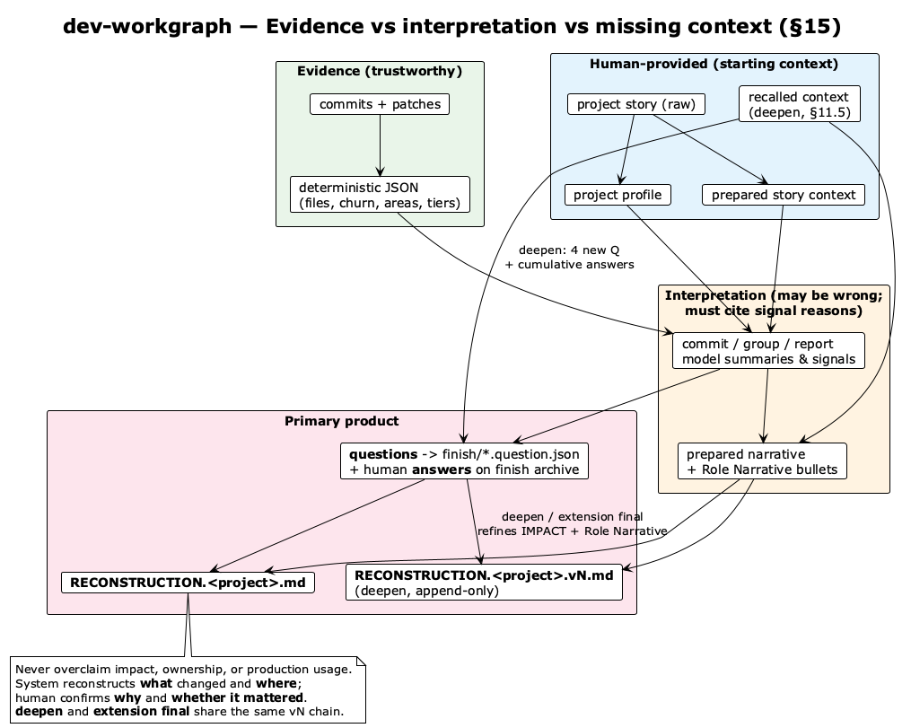

| Layer | Trust | Examples |
|-------|--------|----------|
| **Evidence** | High | patches, deterministic JSON (files, churn, areas), commit timestamps |
| **Interpretation** | May be wrong; must cite signal reasons | commit/group/report model summaries, prepared narrative |
| **Missing context** | Recovered via human | `questionsAnalyses` → interactive Q&A → finish archive |

**Core rule:** never overclaim production usage, customer impact, or org-wide adoption unless the developer stated it in an answer.

Every LLM step after `init` receives a **project context block** (role, prepared story, profile from README + story). Questions are framed by seniority (Principal / Staff / Senior / Junior).

## System context

```text
                    ┌─────────────────────────────┐
                    │ Local LLM backends          │
                    │  • Ollama      (:11434)     │
                    │  • LM Studio   (:1234)      │
                    │  3 slots: commit/report/    │
                    │           narrative         │
                    └──────────────▲──────────────┘
                                   │ HTTP chatJson
┌─────────────┐                    │
│ Your repo   │◄── git ── ┌────────┴────────┐
└─────────────┘           │ dev-workgraph   │
                          │ CLI (Node)      │
                          └────────┬────────┘
                                   │ read/write
                                   ▼
                          ┌────────────────────┐
                          │ ~/.workgraph/      │
                          │  config.json (llm) │
                          │  data/repos/…      │
                          └────────────────────┘
```

`check` and `run` discover **both** backends. Each slot stores `{ provider, baseUrl, model }` in `config.json` → `llm`. LM Studio pipeline steps unload/load models between stages.

**Stack:** `commander` (CLI), `inquirer` (prompts), pluggable LLM providers (`src/lib/llm/`), structured JSON via `chatJson` (Ollama `format`; LM Studio OpenAI-compatible `response_format` with fallbacks) + schema validation (`parseAndValidateModelJson`). Each written JSON artifact carries `schemaVersion` (encoded CLI semver).

## End-to-end pipeline

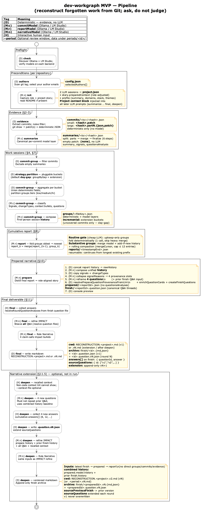


Stages run in order; `run` orchestrates through `final`. **`deepen`** is optional and **not** part of `run`.

| Phase | Commands | LLM slot | Resume |
|-------|----------|----------|--------|
| Preflight | `check` | — | — |
| Preconditions | `authors`, `init` | narrative (`init`) | idempotent |
| Evidence | `evidence`, `summarize` | commit (`summarize`) | append-only |
| Work sessions | `commit-group` | commit | extension groups |
| Cumulative report | `report` | report | fold chain resume |
| Prepared narrative | `prepare` | narrative | idempotent per report |
| Deliverable | `final` | narrative | reuse or append vN |
| Extension | `deepen` | narrative | append-only vN+1 |

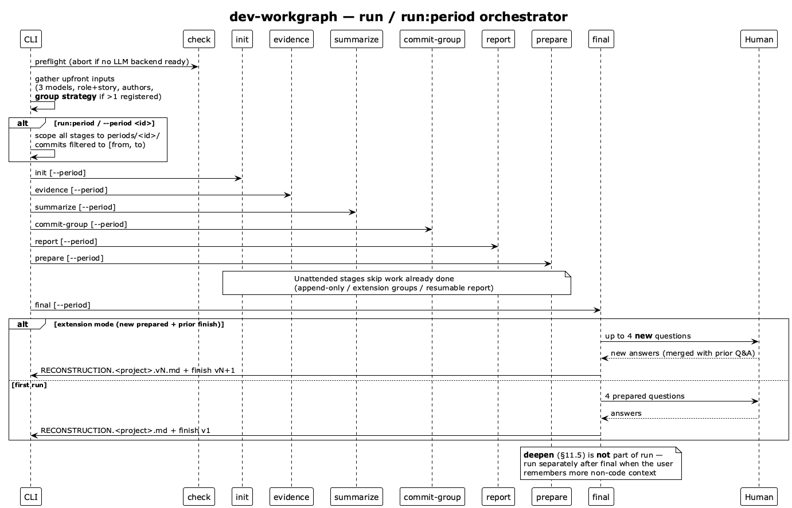

### Three model slots (Ollama / LM Studio)

| Slot | Commands | Typical use |
|------|----------|-------------|
| `commitModel` | `summarize`, `commit-group` | High volume per-commit / per-session |
| `reportModel` | `report` | Cumulative fold over groups |
| `narrativeModel` | `init`, `prepare`, `final`, `deepen` | Prose, claim-safe narrative |

Saved in `~/.workgraph/config.json` under `llm` (`commit` / `report` / `narrative` with `provider`, `baseUrl`, `model`). `run` asks once upfront — models from all reachable backends appear in one picker (`name (Ollama)` / `name (LM Studio)`).

CLI flags: `--ollama-url`, `--lmstudio-url`. See [`REQUIREMENTS.md`](REQUIREMENTS.md) §13.

## On-disk layout

Each Git repository gets an isolated namespace: `~/.workgraph/data/repos/<repo-id>/` where `<repo-id>` = `<basename>-<hash8>`.

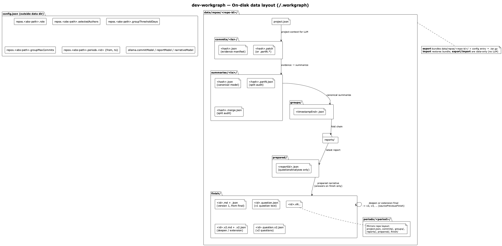

```text
data/repos/<repo-id>/
  project.json                 # role, story, profile, tokenUsage
  commits/<ts>/<hash>.{patch,json}    # evidence (deterministic)
  summaries/<ts>/<hash>.json          # commit model layer
  groups/<timestampEnd>.json
  reports/<reportId>.json
  prepared/<reportId>.json            # questions only — no answers
  finish/
    <id>.json                         # FinishRecord
    <id>.question.json                # v1 questions
    <id>.v2.json / .question.v2.json  # deepen / extension
    <id>.md
```

**Review periods** (`--period <id>`) mirror this tree under `periods/<id>/`. Config (authors, saved grouping strategy) lives in `config.json` outside the data dir; strategy-specific settings (e.g. day-gap thresholds) are persisted per repo by the active strategy; `export` bundles both.

## Phase 1 — Preconditions

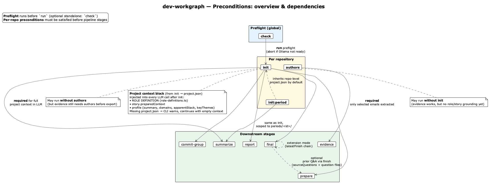

- **`authors`** — filter commits by selected author emails (required before `evidence`).
- **`init`** — role + project story + README → `project.json` (required before model layers on commits/groups/report).
- **`check`** — discover Ollama + LM Studio; verify each backend has models; validate saved slots.

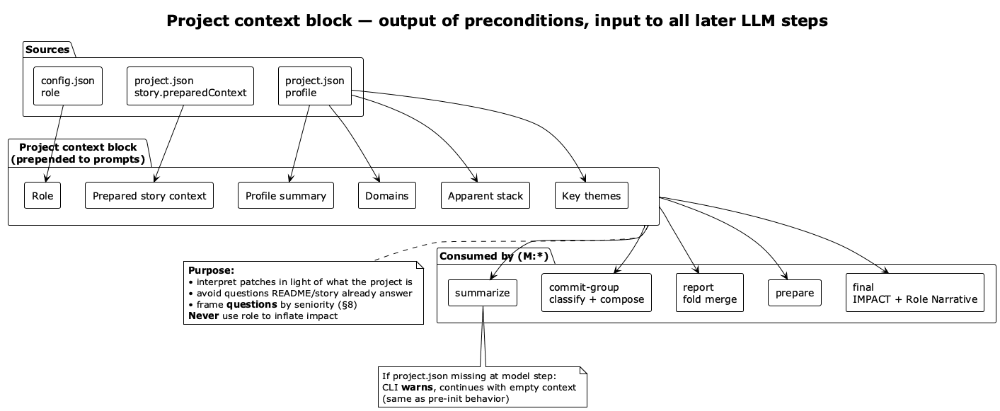

The context block is prepended to every later LLM prompt so summaries and questions respect role and project backstory.

## Phase 2 — Commit evidence

**`evidence`** (deterministic): `git show` → patch + JSON with files, churn, areas, noise filtering.

**`summarize`** (`commitModel`): per-commit model layer — summary, signals + reasons, `questionsAnalysis`.

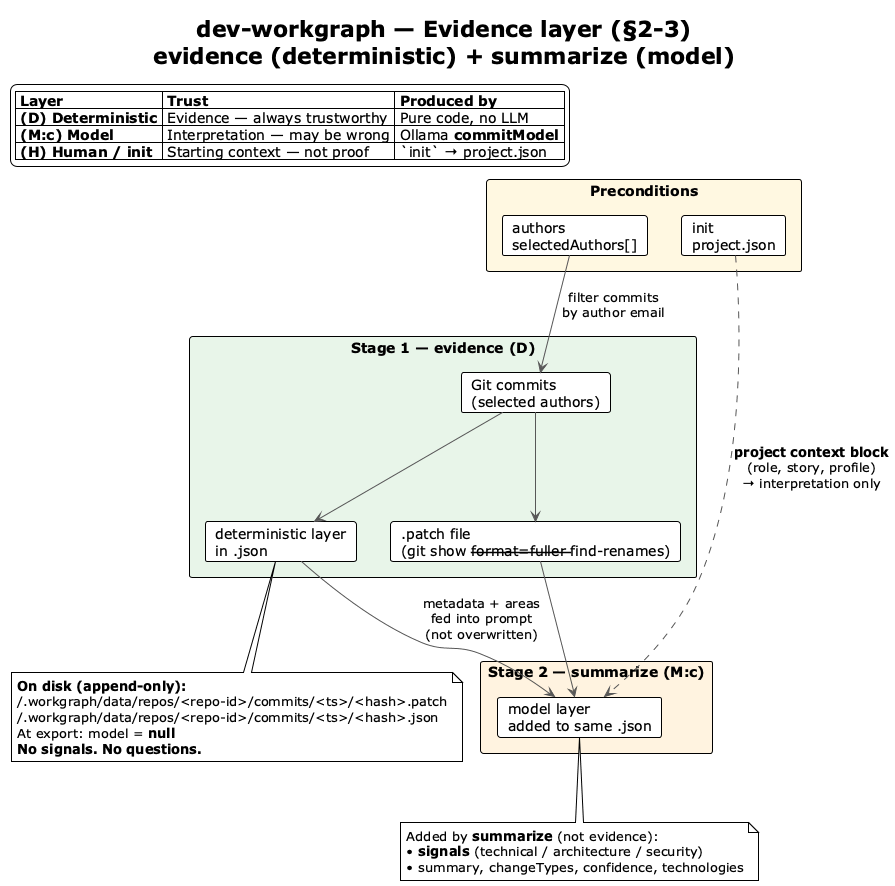

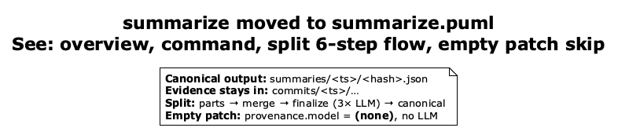

Commit evidence and summaries are **separate files** (`commits/` vs `summaries/`) so evidence stays stable when models or prompts change.

## Phase 3 — Work sessions (`commit-group`)

Partitions summarized commits into **work sessions** (groups), then runs the same LLM classify/compose pipeline for each bucket. **How** commits are partitioned is pluggable; **what** gets written under `groups/` is fixed so `report` stays unchanged.

### Default: day-gap strategy

Shipped strategy `day-gap` groups chronologically by gap (`groupThresholdDays`) and optional `groupMaxCommits`. CLI flags: `--days`, `--max-commits` (registered by the strategy, not the core command).

### Fixed runner (not pluggable)

For every partition bucket the action:

1. **Deterministic** — `buildGroupRecord`: union membership, aggregate churn/areas, `groups.tiers` (hi / medium / low).
2. **Model** (`commitModel`) — session signals, context bullets, `questionsAnalyses`, first-person `history`.

The strategy only supplies **buckets** (`members` + `fileKey` for `groups/<fileKey>.json`). Downstream `report` still reads `GroupRecord` files regardless of how they were formed.

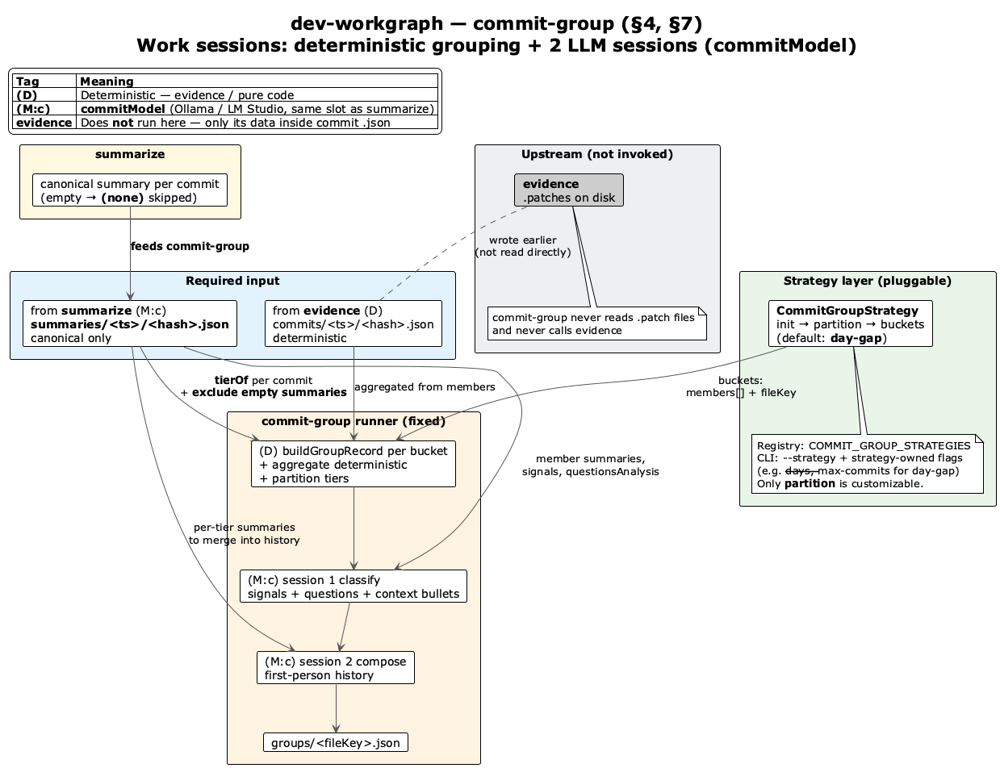

On incremental re-run, the default strategy uses **extension tails** (`extensionSessions` in `grouping.ts`) so only **uncovered** commits get new extension groups — prior summarized groups are not rewritten.

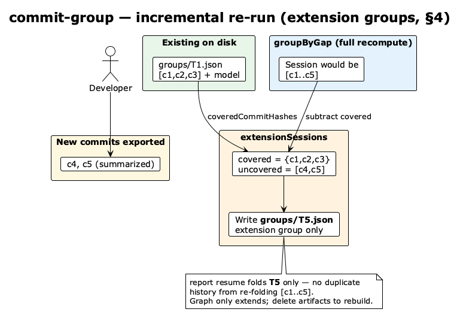

CLI: `--strategy <id>` selects the registered strategy (default: first in `COMMIT_GROUP_STRATEGIES`). `run` prompts for strategy when more than one is registered; choice is saved as `commitGroupStrategy` in repo config. Plugin architecture: [Extending commit-group strategies](#extending-commit-group-strategies) below.

## Phase 4 — Cumulative report (`report`)

Incremental **fold** over groups (oldest first): `report_k = merge(report_{k-1}, group_k)`.

- **Routine gate** — cheap LLM call; upkeep-only groups fold deterministically (one call, skip heavy merge).
- **Substantive groups** — merge model fields, add-if-new history, rolling compaction (`mergeCursor`, cap ≤ 12 history entries).
- **Resumable** — each fold writes `reports/<timestampEnd>.json`; re-run continues from longest prefix.

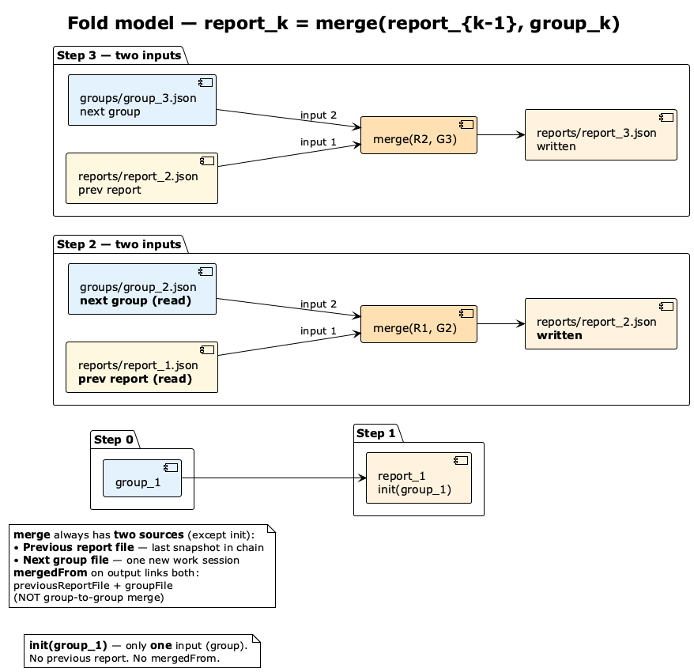

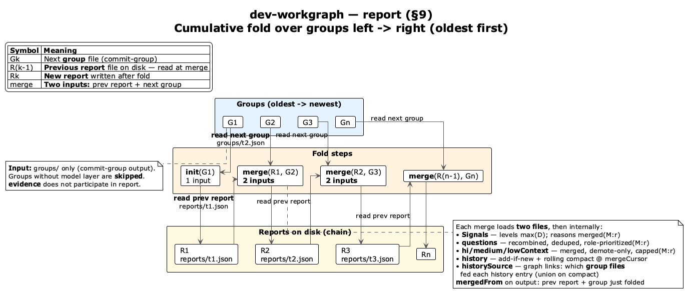

Provenance: `sourceGroups[]` lists contributing group files; `history[i]` ↔ `deterministic.historySource[i]`.

## Phase 5 — Prepared narrative (`prepare`)

Distills the **latest** report into one role-aligned artifact — sole direct input to `final`.

Four `narrativeModel` sessions + deterministic copies:

1. Compose unified **history** (one string).
2. Clean **technologies** (max 5).
3. Collapse **signalReasons** → 4 strings.
4. Reframe **questionsAnalyses** → up to 4 threads (skips threads already answered in latest finish).

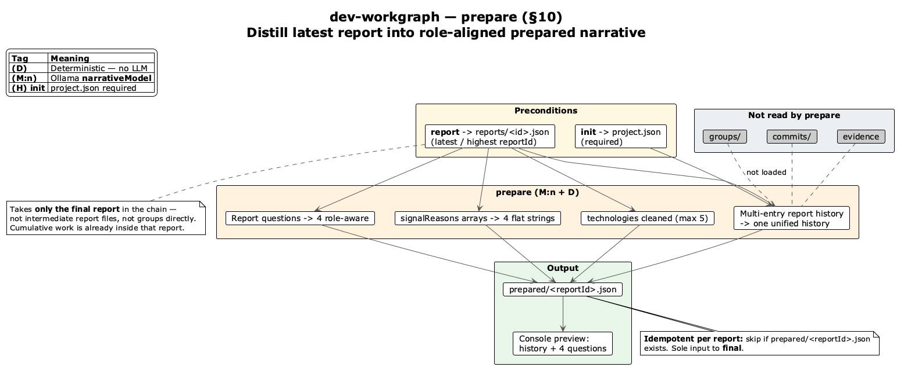

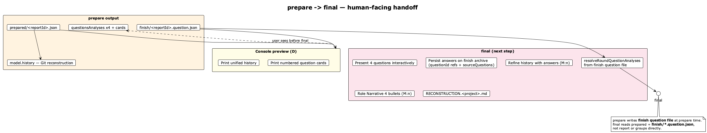

**No `answers` on prepared** — human Q&A lives only under `finish/` so incremental `prepare` does not treat old questions as already handled incorrectly.

## Phase 6 — Final deliverable (`final`)

Closes the loop: human answers → refined IMPACT → Role Narrative → CV bullets → markdown.

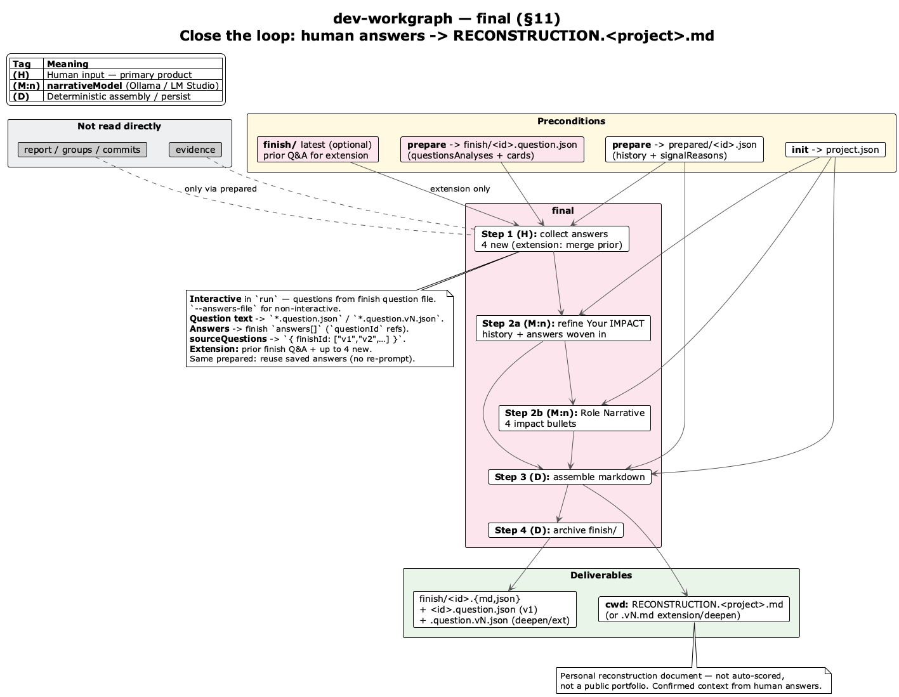

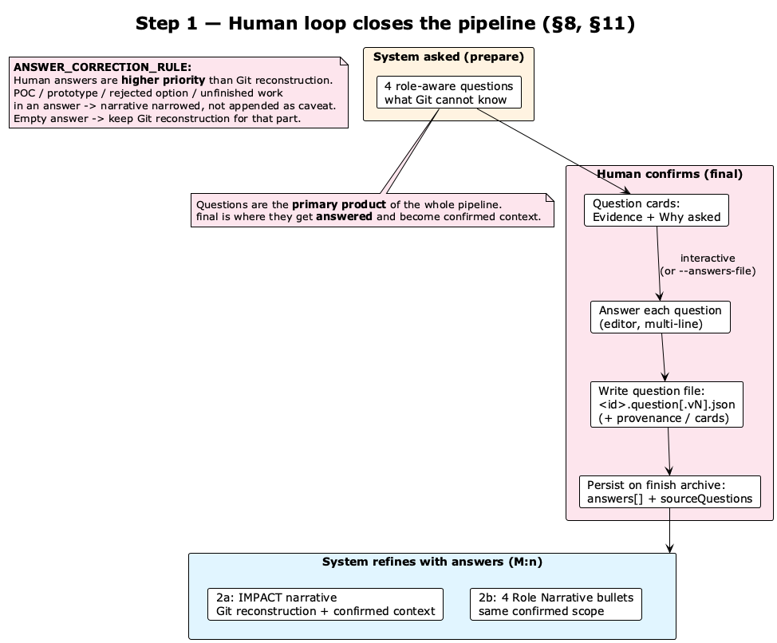

### Q&A artifact model

Three cooperating pieces on the **finish** chain:

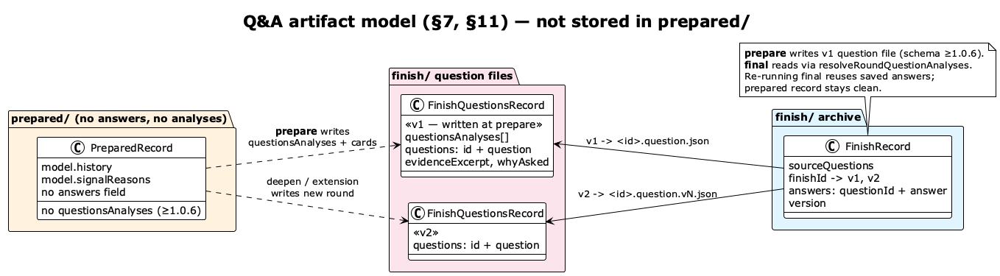

| Piece | Location | Content |
|-------|----------|---------|
| Question text | `finish/<id>.question.json`, `.question.vN.json` | `{ id, question }[]` — id = Unix-ms |
| Answers | `finish/<id>.json` | Cumulative `{ questionId, answer }[]` |
| Rounds | `sourceQuestions` on finish record | `{ "<finishId>": ["v1", "v2", …] }` |

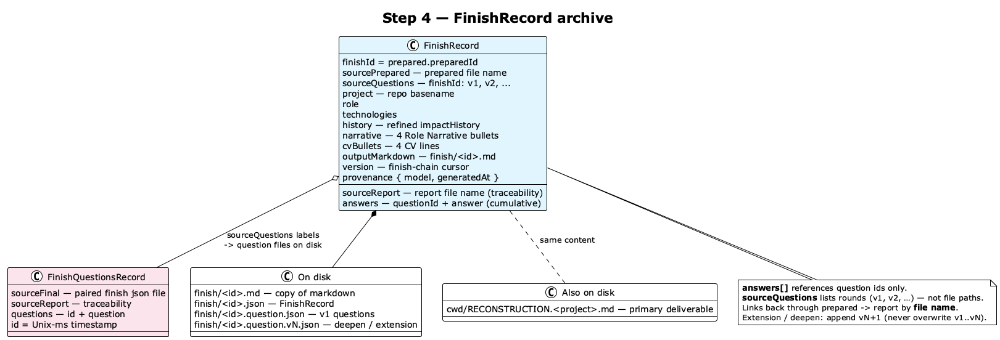

**Extension mode** (new commits → new `prepared/`): load prior finish Q&A, ask only **new** deduped questions, append `finish/<id>.vN.json` — never overwrite v1.

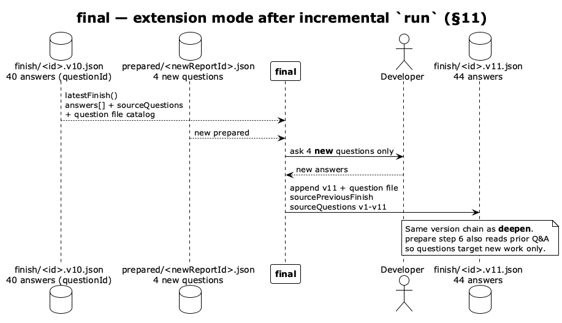

Deliverable: `RECONSTRUCTION.<project>.md` in **cwd** (not repo path) + copy under `finish/`.

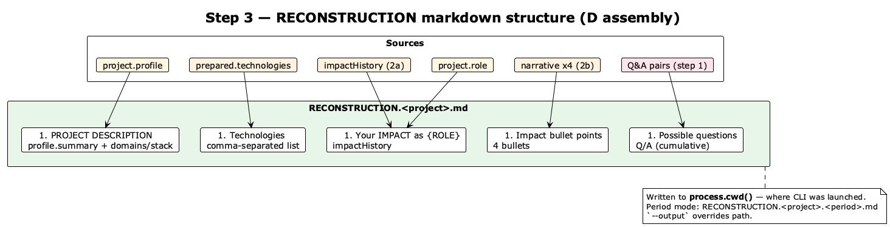

Three `narrativeModel` sessions in `final`: refine IMPACT → Role Narrative (4 bullets) → CV bullets (4 lines).

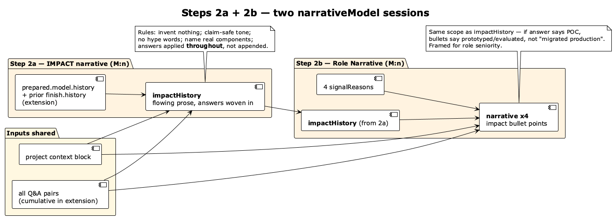

## Phase 7 — Narrative extension (`deepen`)

Optional post-`final`: recalled non-code context → 4 new questions → cumulative Q&A → refined narrative → **`RECONSTRUCTION.<project>.v2.md`** (append-only).

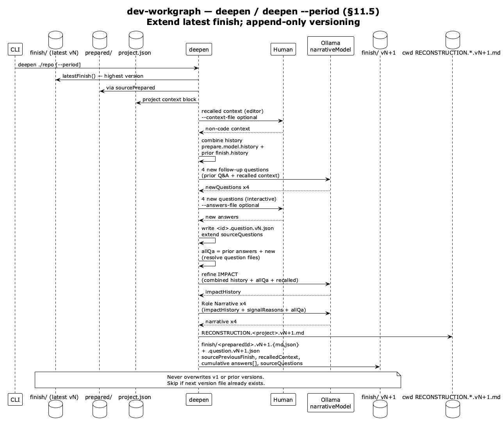

Combined history baseline: `prepared.model.history` + prior `finish.history`. Does not re-read commits/evidence — only finish → prepared → report chain.

## Cross-cutting concerns

### Provenance

Links are **file names only** (no commit hashes on finish/prepared):  
`finish` → `sourcePrepared` → `prepared` → `sourceReport` → `report` → `sourceGroups[]` → groups → summaries/commits.

### Token usage

Each `chatJson` call logs tokens to stderr; `project.json` accumulates `tokenUsage` by step and model.

### Portability

`export` / `import` move `data/repos/<repo-id>/` + config entry as `.workgraph.tar.gz` — no LLM calls.

### Resilience

- JSON Schema validation on every model response; retries (2×) with backoff.
- `temperature: 0.2` only; context/predict limits left to backend defaults (`num_ctx` / Modelfile on Ollama).
- **`commitModel`** / **`reportModel`**: `think: false` on Ollama; **`narrativeModel`**: Ollama default for thinking-capable models.
- Append-only / resumable stages — safe to stop mid-pipeline and re-run `dev-workgraph run .`.

## CLI module map

Implementation lives in [`dev-workgraph-cli/src/`](dev-workgraph-cli/src/):

| Area | Path |
|------|------|
| Commands | `src/actions/*.ts` — one file per pipeline stage |
| Records / types | `src/lib/records.ts`, `model.ts` |
| LLM providers | `src/lib/llm/` — Ollama, LM Studio, registry, `chatJson` |
| Commit-group strategies | `src/lib/commit-group/` — partition plugins, registry, CLI helpers |
| Legacy re-exports | `src/lib/ollama.ts` |
| JSON validation | `src/lib/json-response.ts` |
| LM Studio lifecycle | `src/lib/lmstudio-session.ts` |
| Grouping primitives | `src/lib/grouping.ts` — `groupByGap`, `extensionSessions`, merge helpers |
| Finish + Q&A | `src/lib/finish-questions.ts`, `finish-load.ts` |
| Config / paths | `src/lib/config.ts` |
| Prompts | `src/lib/prompts.ts` |

### Extending LLM providers

Local LLM backends are **plugins**. Ollama and LM Studio ship in-tree; you can add another server without touching every pipeline command.

**Registration point:** `LLM_PROVIDER_KINDS` in `src/lib/llm/providers.ts`.

```typescript
export const LLM_PROVIDER_KINDS: readonly LlmProviderKind[] = [ollamaKind, lmstudioKind];
```

**Steps to add a provider:**

1. **`LlmProviderId`** — extend the union in `src/lib/llm/types.ts` (e.g. `"ollama" | "lmstudio" | "myserver"`).
2. **`LlmProvider`** — runtime at a fixed base URL: `isReachable`, `getModels`, `chatJson` (structured JSON + schema validation via `parseAndValidateModelJson`), optional `loadModel` / `unloadAll`.
3. **`LlmProviderKind`** — static plugin object. Templates: `ollamaKind` in `ollama.ts`, `lmstudioKind` in `lmstudio.ts`. Required fields: `id`, `displayName`, `defaultBaseUrl`, `cliUrlOption`, `cliUrlDescription`, `create`, `resolveUrl`, `acceptForDiscovery`, `printInstallHelp`, `printNoModelsHelp`. Optional: `needsStepLifecycle` + `prepareStep` / `releaseStep`, `aliases`, `isBinaryInstalled`.
4. **Register** — import your kind and append it to `LLM_PROVIDER_KINDS`.

Once registered, the backend is picked up automatically:

| Wired for you | How |
|---------------|-----|
| CLI URL flag | `registerLlmProviderOptions` reads `cliUrlOption` (`--myserver-url`) |
| Discovery / `check` | `LlmProviderRegistry.discover` iterates `LLM_PROVIDER_KINDS` |
| Model picker | `listModelChoices` lists models from all reachable backends |
| Install help | `printNoLlmBackendsHelp` calls each kind's `printInstallHelp` |

Config slots store `{ provider, baseUrl, model }` under `config.llm` — the new `id` must match `LlmProviderId`.

If you implement a provider for a widely used local stack, please open a pull request — thank you for contributing!

### Extending commit-group strategies

**Partition logic** is a plugin layer. The shipped `day-gap` strategy lives in `day-gap-strategy.ts`; the `commit-group` action and `report` never import it directly — only `registry.ts` wires implementations.

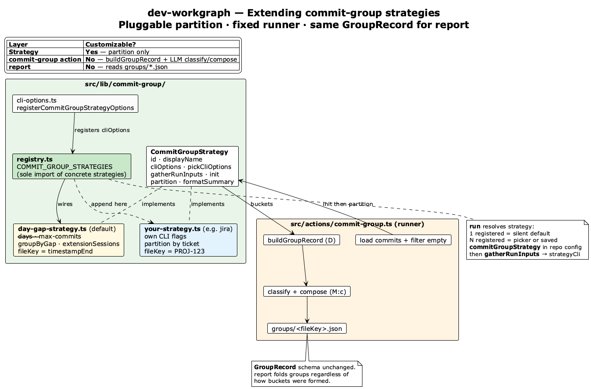

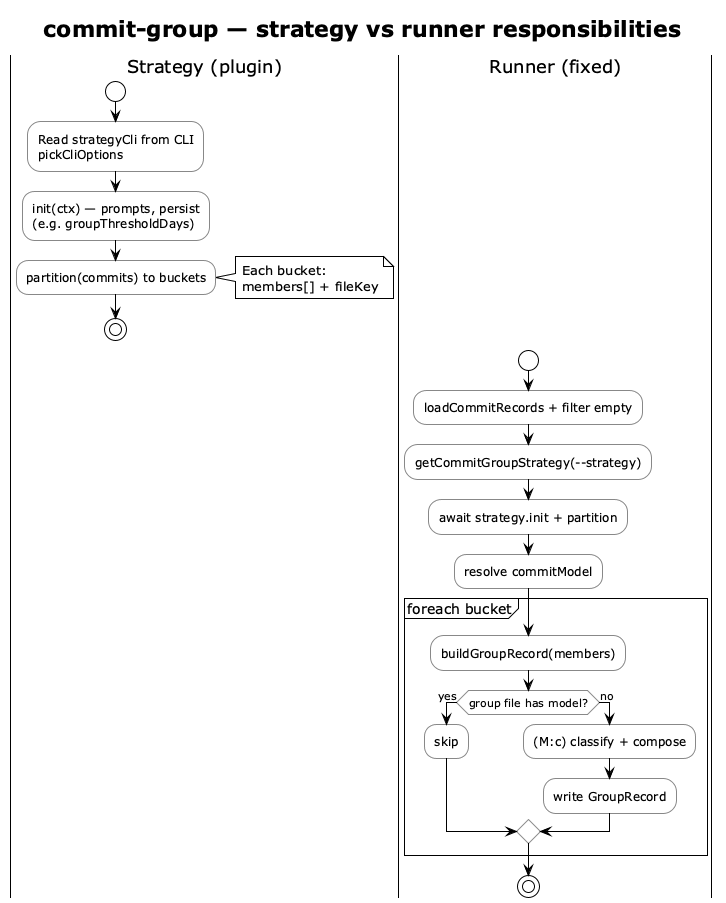

**Registration point:** `COMMIT_GROUP_STRATEGIES` in `src/lib/commit-group/registry.ts`.

```typescript
export const COMMIT_GROUP_STRATEGIES: readonly CommitGroupStrategy[] = [dayGapStrategy];
```

**What you customize:** only how commits are split into buckets. The runner always builds `GroupRecord`, runs classify + compose LLM steps, and writes `groups/<fileKey>.json` in the format `report` expects.

**What stays fixed:** `summarize` output as input, `GroupRecord` schema, `commitModel` prompts, incremental skip when `group.model` already exists, `--limit` / `--period`.

**`CommitGroupStrategy` interface** (`src/lib/commit-group/types.ts`):

| Method / field | Role |
|----------------|------|
| `id`, `displayName` | CLI `--strategy`, `run` picker, saved `commitGroupStrategy` |
| `cliOptions` | Strategy-owned Commander flags (e.g. `--days`, `--max-commits`) |
| `pickCliOptions(opts)` | Extract only this strategy's fields from parsed CLI options |
| `init(ctx)` | Prompts, persisted repo settings, returns `params` for `partition` |
| `partition(commits, init, ctx)` | Async — returns `buckets[]` + stats (`rawBucketCount`, `pendingCount`, `fullyCovered`) |
| `formatSummary(ctx, init, partition)` | One-line human summary before LLM summarize loop |

Each bucket: `{ members: CommitRecord[], fileKey: string }` where `fileKey` is the basename for `groups/<fileKey>.json` (day-gap uses `timestampEnd`; a Jira strategy might use ticket id).

**Steps to add a strategy:**

1. **Implement** `CommitGroupStrategy` in e.g. `src/lib/commit-group/jira-strategy.ts`. Reuse helpers from `grouping.ts` when useful (`groupByGap`, `extensionSessions`, `coveredCommitHashes`); not required.
2. **Register** — import and append to `COMMIT_GROUP_STRATEGIES` in `registry.ts` (sole import site for concrete strategies).
3. **CLI** — `registerCommitGroupStrategyOptions` (in `cli-options.ts`) registers every strategy's `cliOptions` on `commit-group`; inactive strategies' flags are ignored via `pickCliOptions`.
4. **Config** — persist strategy-specific keys inside `init` (day-gap uses `groupThresholdDays` / `groupMaxCommits` on `RepoConfig`); the runner only stores `commitGroupStrategy` id.

`run` calls `resolveRunGroupStrategy`: one registered strategy → use it silently; several → list picker (or reuse saved `commitGroupStrategy`). Strategy-specific prompts (e.g. day gap) run inside `init` at the `commit-group` step, not in `run`.

Example alternative partition: group by Jira ticket parsed from commit messages, one bucket per ticket, `fileKey` = ticket key — same `GroupRecord` output, different session boundaries for `report` to fold.

If you implement a generally useful grouping strategy, please open a pull request.

## Diagram index

| Topic | Source | PNG |
|-------|--------|-----|
| Full pipeline | `uml/pipeline.puml` | `img/dev-workgraph-pipeline.png` |
| Pipeline graph | `uml/pipeline-graph.dot` | `img/pipeline-graph.png` |
| Data layout | `uml/pipeline.puml` | `img/dev-workgraph-data-layout.png` |
| Evidence principle | `uml/pipeline.puml` | `img/dev-workgraph-evidence-principle.png` |
| Preconditions | `uml/preconditions.puml` | `img/preconditions-*.png` |
| Evidence | `uml/evidence.puml` | `img/evidence-*.png` |
| Summarize | `uml/summarize.puml` | `img/summarize-*.png` |
| Commit-group | `uml/commit-group.puml` | `img/commit-group-*.png` |
| Commit-group plugins | `uml/commit-group-strategies.puml` | `img/commit-group-strategies*.png` |
| Report | `uml/report.puml` | `img/report-*.png` |
| Prepare | `uml/prepare.puml` | `img/prepare-*.png` |
| Final | `uml/final.puml` | `img/final-*.png` |
| Deepen / run | `uml/pipeline.puml` | `img/dev-workgraph-deepen.png`, `dev-workgraph-run-orchestrator.png` |

Regenerate all PNGs (see [`uml/README.md`](uml/README.md) for diagram legend):

```bash
./scripts/generatePNGFromSchemas.sh
```

## Further reading

- [`REQUIREMENTS.md`](REQUIREMENTS.md) — full specification (schemas, prompts, edge cases)
- [`README.md`](README.md) — quick start and motivation
- [`examples/`](examples/) — sample `RECONSTRUCTION.*.md` outputs
- [`dev-workgraph-cli/README.md`](dev-workgraph-cli/README.md) — install and commands
