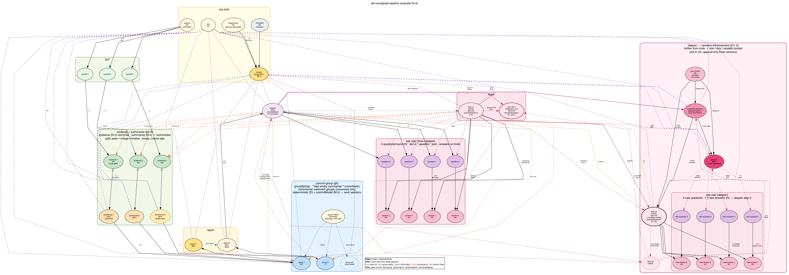

# dev-workgraph

**Turn a Git repository into a career story you can defend** — for a performance review, a CV, or interview prep.

You point the CLI at a repo where you actually worked. It reads your commits and patches, asks what Git cannot know, you confirm the missing context, and it writes **`RECONSTRUCTION.<project>.md`**: what you did, where in the system, and what impact means for **your role** (Principal, Staff, Senior, Junior) — with role narrative bullets and CV bullets grounded in evidence, not a blank ChatGPT prompt.

## Why this exists

**The problem.** Sooner or later you must explain your work — at a half-yearly or annual review, on a resume, to a recruiter, to an ATS, or for a project you shipped years ago. You were busy — but memory fades. Git remembers *diffs*; it does not remember *why*, *whether it shipped*, *who owned the design*, or *how it maps to impact*. Generic AI can polish prose, but it invents or drifts because it never saw your repo or your answers.

**What dev-workgraph does instead.** It **reconstructs** work from **your** Git history plus **your** confirmations:

| You need to… | What you get |
|--------------|--------------|
| **Performance review** | First-person **Your IMPACT**, four role-framed bullets, technologies — tied to commits and signals from the period |
| **CV / resume** | Four impersonal **CV bullets** with real stack and architecture keywords from the codebase |
| **Interview prep** | A readable narrative of what you built and **Possible questions** with your own answers — ownership, production, design vs implementation |

This is **not** a commit counter, activity heatmap, or auto-scored achievement tool. It does **not** claim customer impact or production usage unless **you** stated that in an answer.

**How it works (short).**

1. **Evidence** — your commits → patches, areas, work sessions, technical/architecture signals.
2. **Ask** — up to four role-aware questions per round (what Git cannot infer).
3. **Confirm** — you answer; answers are stored on the finish archive, separate from the prepared narrative.
4. **Deliver** — `RECONSTRUCTION.<project>.md` (+ optional `.v2.md` after **`deepen`** when you recall more team context, pivots, or review framing).

See real outputs in [`examples/`](./examples/) — e.g. [Forge Secure Notes](examples/Forge-Secure-Notes-for-Jira/RECONSTRUCTION.Forge-Secure-Notes-for-Jira.v2.md) (Principal), [keycloak-radius-plugin](examples/keycloak-radius-plugin/RECONSTRUCTION.keycloak-radius-plugin.v2.md) (Staff, open-source IAM), and [this CLI](examples/dev-workgraph/RECONSTRUCTION.dev-workgraph.v2.md) (Staff).

## Quick start

**Prerequisites:** [Node.js](https://nodejs.org) 20+, Git, and [Ollama](https://ollama.com) running locally.

```bash
brew install ollama
ollama pull qwen2.5-coder:14b
ollama pull gpt-oss:latest
ollama pull gemma4:31b
ollama serve
```

```bash
cd /path/to/your/repo
npx dev-workgraph run .
```

The pipeline ends with **`final`**: you answer up to four questions interactively. The markdown deliverable is written to your **current working directory**. Everything before that can run unattended and be resumed.

Example outputs: [`examples/Forge-Secure-Notes-for-Jira/`](./examples/Forge-Secure-Notes-for-Jira/) · [`examples/keycloak-radius-plugin/`](./examples/keycloak-radius-plugin/) · [`examples/dev-workgraph/`](./examples/dev-workgraph/).

See **[`dev-workgraph-cli/README.md`](./dev-workgraph-cli/README.md)** for commands, data layout, and development.

## Review periods

Doing a **periodic review** ("what did I do in 2024?")? Scope the whole pipeline to a date window with `--period`:

```bash
dev-workgraph init:period ./repo --period 2024 --from 2024-01-01 --to 2025-01-01
dev-workgraph run:period  ./repo --period 2024
```

The deliverable is written with a period suffix — `RECONSTRUCTION.<project>.2024.md` — so a period review never overwrites your all-time reconstruction. Period data lives in its own subtree and inherits the project context from `init`. Every pipeline command accepts `--period <id>`.

## How it runs

**Local only** — [Ollama](https://ollama.com) on your machine. No cloud API; analysis stays under `~/.workgraph/` unless you `export` a bundle yourself.

**Resumable** — stop anytime before `final`; re-run `dev-workgraph run .` and completed commits, groups, and report folds are skipped. Interactive Q&A starts only after `prepare`.

**Dogfooded** on **MacBook Pro M4 Pro (48 GB)**. One real repo (**~300 commits**): unattended stages took **~6 hours** before the first questions (`final`). Time depends on models, patch size, and cache from prior runs.

### Recommended Ollama models

Use strong models for real runs — weak ones work for smoke tests but hurt long reports.

| Slot | Model | Used for |
|------|--------|----------|
| `commitModel` | `qwen2.5-coder:14b` | `summarize`, `commit-group` |
| `reportModel` | `gpt-oss:latest` | `report` |
| `narrativeModel` | `gemma4:31b` | `init`, `prepare`, `final`, `deepen` |

`run` saves the three slots in `~/.workgraph/config.json`.

## Repository layout

| Path | Description |
|------|-------------|
| [`dev-workgraph-cli/`](./dev-workgraph-cli/) | Node.js CLI — install, usage, examples |
| [`examples/`](./examples/) | Sample `RECONSTRUCTION.*.md` outputs — see [`examples/README.md`](./examples/README.md) |
| [`ARCHITECTURE.md`](./ARCHITECTURE.md) | Architecture overview + diagrams from `img/` |
| [`REQUIREMENTS.md`](./REQUIREMENTS.md) | Full product & pipeline specification |
| [`uml/`](./uml/) | Pipeline diagrams (PlantUML, Graphviz) — PNG: `./scripts/generatePNGFromSchemas.sh` → [`img/`](./img/) |

## The work graph

Under the hood, dev-workgraph builds a **directed graph from your Git history and your answers**. Every commit, work session, report, question, and answer is a vertex; the edges carry meaning — build order, provenance links back to the evidence, the project context injected into each LLM step, and your Q&A. The final narrative is a fold over this graph, so every claim stays traceable to the commit or answer it came from.

This graph is also a natural foundation for future work: it could be loaded into a **vector database** to power a **RAG** system over your own history. The whole pipeline safely builds the **grounded knowledge base — the "R" of RAG** — from real Git evidence and human-confirmed context: traceable end to end and never inflated with impact you did not state. Generation can come later; the retrievable corpus is one you can defend.


