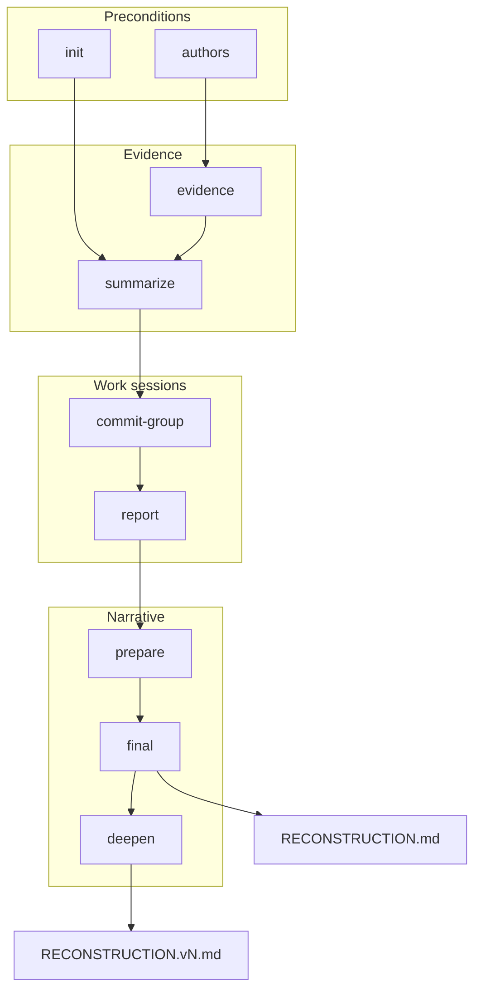

# dev-workgraph-cli

Reconstruct forgotten engineering work from Git history — and ask the questions Git cannot answer.

**dev-workgraph** is a local CLI that turns your commits, patches, and project context into a personal reconstruction document: what you worked on, where, and (after you confirm it) how it maps to your role. It does **not** score achievements, build a public portfolio, or invent production impact.

Runs **fully on-device** via Ollama. Developed on **MacBook Pro M4 Pro (48 GB)**; a **~300-commit** repo took **~6 hours** for unattended stages before `final` questions. Stages are **append-only / resumable** — interrupt and re-run `dev-workgraph run .` to continue.

The questions are the primary product. Summaries and area detection are supporting material.

Full specification: [`../REQUIREMENTS.md`](../REQUIREMENTS.md).

## What you get

The main deliverable is **`RECONSTRUCTION.<project>.md`** in your current working directory — a markdown file with:

- project description (from README + your story)
- **Your IMPACT** — first-person narrative woven with your answers
- technologies, role narrative bullets, CV bullets
- **Possible questions** — the Q&A that grounded the narrative

After `deepen`, versioned siblings appear (`RECONSTRUCTION.<project>.v2.md`, …).

Sample outputs in [`../examples/`](../examples/):

- [`Forge-Secure-Notes-for-Jira.v2.md`](../examples/Forge-Secure-Notes-for-Jira/RECONSTRUCTION.Forge-Secure-Notes-for-Jira.v2.md) — Jira Forge security app (~300 commits)
- [`dev-workgraph.v2.md`](../examples/dev-workgraph/RECONSTRUCTION.dev-workgraph.v2.md) — this CLI

## Prerequisites

- **Node.js** 20+
- **Git** repository with your commits
- **[Ollama](https://ollama.com)** running locally — **use strong models** for production runs

### Suggested models (author’s setup)

| Slot | Model | Commands |
|------|--------|----------|
| `commitModel` | `qwen2.5-coder:14b` | `summarize`, `commit-group` |
| `reportModel` | `gpt-oss:latest` | `report` |
| `narrativeModel` | `gemma-4-31B` | `init`, `prepare`, `final`, `deepen` |

```bash
brew install ollama
ollama serve
ollama pull qwen2.5-coder:14b
ollama pull gpt-oss:latest
ollama pull gemma-4-31B

dev-workgraph check
```

Smaller models work for smoke tests; long folds and role narrative quality suffer on weak models.

## Install

From this directory:

```bash
cd dev-workgraph-cli
npm install
npm run build
npm link   # optional: global `dev-workgraph` command
```

Or run without linking:

```bash
node dev-workgraph-cli/dist/cli.js --help
```

## Quick start

```bash
cd /path/to/your/repo

# one-shot pipeline (init → evidence → … → prepare → final)
dev-workgraph run .

# final is interactive: answer up to four role-aware questions
# → writes ./RECONSTRUCTION.<repo-basename>.md
```

**First run** asks for: Ollama models (`commitModel`, `reportModel`, `narrativeModel`), developer role, project story (if not saved), author emails, and grouping thresholds.

**Re-run** after new commits is safe: stages skip work already done; `final` may enter **extension mode** (new questions only, append-only finish versions).

**Interrupt anytime** before `final`: evidence, summaries, groups, and report folds are persisted incrementally. The next `run` or individual command resumes from the last completed artifact — you do not pay twice for finished commits.

## Pipeline



| Stage | Command | LLM | What it does |
|-------|---------|-----|--------------|
| Preflight | `check` | — | Ollama reachable, models installed |
| Authors | `authors` | — | Select your commit emails |
| Context | `init` | narrative | Role, project story, README → `project.json` |
| Evidence | `evidence` | — | Patches + deterministic JSON per commit |
| Commit layer | `summarize` | commit | Per-commit summary, signals, questions |
| Sessions | `commit-group` | commit | Group by day gap; session history |
| Cumulative | `report` | report | Fold groups → growing narrative report |
| Distill | `prepare` | narrative | One history + up to 4 questions for `final` |
| Deliver | `final` | narrative | **You answer** → `RECONSTRUCTION.<project>.md` |
| Extend | `deepen` | narrative | Recalled context + 4 new Q&A → `.v2.md`, … |

`run` executes everything through `final`. `deepen` is **not** part of `run` — run it separately when you remember more context.

## Commands

```bash
dev-workgraph check
dev-workgraph init         ./repo
dev-workgraph authors      ./repo
dev-workgraph evidence     ./repo
dev-workgraph summarize    ./repo
dev-workgraph commit-group ./repo
dev-workgraph report       ./repo
dev-workgraph prepare      ./repo
dev-workgraph final        ./repo
dev-workgraph deepen       ./repo
dev-workgraph run          ./repo
dev-workgraph export       ./repo
dev-workgraph import       <bundle.tar.gz>
dev-workgraph init:period  ./repo --period 2024 --from 2024-01-01 --to 2025-01-01
dev-workgraph run:period   ./repo --period 2024
```

Common flags:

- `--period <id>` — scope to a review window (`periods/<id>/` data subtree)
- `--model <name>` — force Ollama model for this command
- `--url <url>` — Ollama base URL (default `http://127.0.0.1:11434`)
- `final --answers-file <path>` — non-interactive answers (JSON)
- `final --output <path>` — override markdown path
- `deepen --context-file <path>` — non-interactive recalled context

## Three Ollama models

Saved in `~/.workgraph/config.json` under `ollama`:

| Slot | Used by | Example |
|------|---------|---------|
| `commitModel` | `summarize`, `commit-group` | `qwen2.5-coder:14b` |
| `reportModel` | `report` | `gpt-oss:latest` |
| `narrativeModel` | `init`, `prepare`, `final`, `deepen` | `gemma-4-31B` |

You can use one model for everything or split fast commit-level work from heavier report/narrative passes.

## On-disk data

All analysis is namespaced per repository:

```
~/.workgraph/
  config.json                          # authors, role, models, periods
  data/repos/<repo-id>/
    project.json                       # role, story, profile
    commits/<ts>/<hash>.{patch,json}   # evidence (deterministic)
    summaries/<ts>/<hash>.json       # commit model layer
    groups/<timestampEnd>.json
    reports/<reportId>.json
    prepared/<reportId>.json           # questions only — no answers
    finish/
      <id>.json                        # finish archive (answers, narrative)
      <id>.question.json               # question text + ids (v1)
      <id>.v2.json                     # after deepen / extension
      <id>.question.v2.json
      <id>.md                          # copy of RECONSTRUCTION markdown
```

`<repo-id>` is `<basename>-<hash8>` from the absolute repo path.

### Q&A storage

Human answers live on the **finish** chain, not in `prepared/`:

- **Question text** — `finish/<id>.question.json` (or `.question.vN.json`), each question has a Unix-ms `id`
- **Answers** — `finish/<id>.json` → `{ questionId, answer }[]` (cumulative)
- **Rounds** — `sourceQuestions: { "<finishId>": ["v1", "v2", …] }` on the finish record

Re-running `final` on the same prepared version reuses saved answers when complete.

## Review periods

Define a time window for performance reviews:

```bash
dev-workgraph init:period ./repo --period 2024-H1 --from 2024-01-01 --to 2024-07-01
dev-workgraph run:period ./repo --period 2024-H1
```

Output: `RECONSTRUCTION.<project>.2024-H1.md` (period suffix avoids overwriting all-time output).

## Portability

```bash
dev-workgraph export ./repo              # → <repo-id>.workgraph.tar.gz
dev-workgraph import ./bundle.workgraph.tar.gz --repo /new/path
```

Bundles data directory + config entry. No LLM calls.

## Core principle

```
Git patches     = evidence (trustworthy)
Model summaries = interpretation (may be wrong; must cite reasons)
Questions       = what Git cannot know
Your answers    = confirmed context (not proof unless you stated it)
RECONSTRUCTION  = personal artifact for review / interview prep — not auto-scored
```

The system reconstructs **what** changed and **where**, asks about ownership and intent, and never upgrades claims beyond what you confirmed.

## Development

```bash
npm run build          # tsc + generate version stamp
npm test               # vitest (308+ tests)
npm run verify         # lint + typecheck + knip
npm run reconstruct    # build + run pipeline on this repo
npm run reconstruct:deepen
```

UML diagrams: [`../uml/`](../uml/) (PlantUML + `pipeline-graph.dot`).

## License

Apache-2.0 — see package metadata and file headers.
